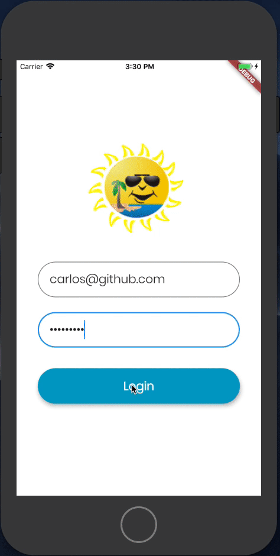

  

<h3 align="center">Simple Login + 3-tab App Using Flutter</h3>

  
  

---

 A Simple Login + 3-tab App Built Using Flutter.
      

## 📝 Table of Contents
- [About](#about)
- [Usage](#usage)
- [Authors](#authors)
- [Acknowledgments](#acknowledgement)
- [Overview](#solutionsoverview)

## 🧐 About 
This repository contains non-sensetive code from one of my pet projects which aims to build a simple - yet effective, app. 

## 🎈 Usage 
- Feel free to use (or tweak it) for your own use. You will only need to fork the project (and give it a star!).

## ✍️  Authors 
- [@carloswhite](https://github.com/carloswhite) - Idea & added work

## 🎉 Acknowledgements 
- Google was and still is my best friend!

## 📈 Overview
 

